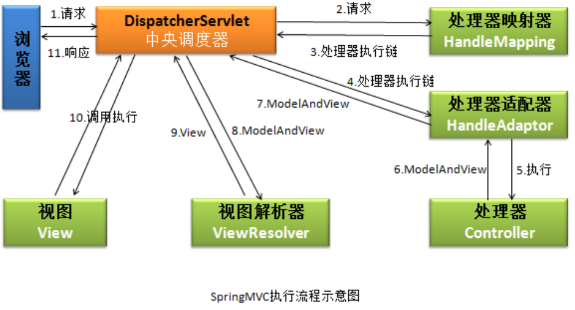

# Blog
个人博客
## 一、项目技术介绍

​	layui网站：https://www.layui.com/demo/

​	本博客运用Java语言开发，适合初学者一起学习。

​	本博客技术主要用到Spring、SpringMVC、Mybatis、Tomcat等框架。

​	前端运用了layui、Jquery、ajax、JavaScript、html、css等。

​	数据库：MySQL。

​	数据库工具：Navicat for MySQL。

​	编译器：IDEA。

​	部署：阿里云服务器

## 二、如何在您的机器上运行本项目

1. 创建数据库，运行项目中blog.sql文件。
2. 在IDEA中Open该项目。
3. 在项目中的resources下面的db.properties文件中修改数据库名，数据库用户名，数据库密码。
4. 在项目中com.blog.mail.SendEmail类中修改授权码。（授权码需要在对应的QQ邮箱或163邮箱中获取，不懂得可自行百度）

## 三、项目流程

## 四、SpringMVC处理一个请求的流程

具体步骤：

第一步：发起请求到中央调度器(DispatcherServlet)

第二步：中央调度器请求HandlerMapping查找 Handler （可以根据xml配置、注解进行查找）

第三步：处理器映射器HandlerMapping向中央调度器返回Handler，HandlerMapping会把请求映射为HandlerExecutionChain对象（包含一个Handler处理器（页面控制器）对象，多个HandlerInterceptor拦截器对象），通过这种策略模式，很容易添加新的映射策略

第四步：中央调度器调用处理器适配器去执行Handler

第五步：处理器适配器HandlerAdapter将会根据适配的结果去执行Handler

第六步：Handler执行完成给适配器返回ModelAndView

第七步：处理器适配器向中央调度器返回ModelAndView （ModelAndView是springmvc框架的一个底层对象，包括 Model和view）

第八步：中央调度器请求视图解析器去进行视图解析 （根据逻辑视图名解析成真正的视图(jsp)），通过这种策略很容易更换其他视图技术，只需要更改视图解析器即可

第九步：视图解析器向中央调度器返回View

第十步：中央调度器进行视图渲染 （视图渲染将模型数据(在ModelAndView对象中)填充到request域）

第十一步：中央调度器向用户响应结果

## 五、总结

  ​        本博客适合初学者学习探讨，希望对Java初学者以及有着Java兴趣爱好的朋友能够有所帮助。不足之处也希望大家能够指出，让我们一起进步。

​       本博客的难点主要是在前端方面，本人主要是做Java后端方面，前端也是边做边学，不太熟悉，很多地方需要阅读相关资料来进一步开发。

​       由于自己也算是初学者，能力有限，望大家发现不足之处可以一起学习探讨，对博客进行完善。

​       将来的你，一定会感谢现在拼命的自己！！！
